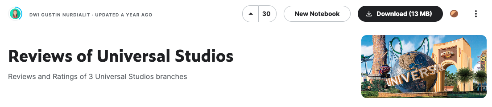

# TripAdvisor Universal Studio Reviews Dataset

## Introduction
This project is about scraping the Universal Studio Review from the Tripadvisor website. There are three branches that were scraped, namely the Florida, Japan and Singapore branches. So there are 3 specific links that we will scraping. This is the Universal Studio Review branch link: <br>
- [**Universal Studios Florida**](https://www.tripadvisor.com/Attraction_Review-g34515-d102432-Reviews-Universal_Studios_Florida-Orlando_Florida.html)
- [**Universal Studios Japan**](https://www.tripadvisor.com/Attraction_Review-g298566-d320976-Reviews-Universal_Studios_Japan-Osaka_Osaka_Prefecture_Kinki.html)
- [**Universal Studios Singapore**](https://www.tripadvisor.com/Attraction_Review-g294264-d2439664-Reviews-Universal_Studios_Singapore-Sentosa_Island.html)

## Scraping Method
Web scraping is simply automatically opening up any website and grabbing the data we found need on that website. It's fundamental to internet. search engines, data science, automation, machine learning and much more.<br>
Writing synchronous web scrapers are easier and the code is less complex, however they are incredibly slow. This because all of the request must wait for the current request to finish one by one. There can only be one request running at a given time.<br>
In contrast, asynchronous web requests are able to execute without depending on previous requests within a queue or for loop. Asynchronous requests happen simultaneously. This means that we can do more things in less time and, when it comes to mining or scraping data, this time saving is absolutely significant.<br>In this project, we will show scraping using Python in a synchronous or asynchronous way

### Synchronous
In the synchronous method, I use the libraries of selenium and chromedriver. there are some challenges that we will find when we do scraping on this TripAdvisor website.<br>
**The "Read More" Link Button**<br>
TripAdvisor only loads part of the review initially and waits until the user clicks Read More to load the rest. When clicked further JavaScript is executed (code below) and is likely to make scraping harder.<br>
```
<div class="DrjyGw-P _1l3JzGX1">Read More</span> == $0
```
<br>The net result is that using a scraping library like Beautiful Soup is not enough and we need to launch a browser and control using Selenium, to simulate pressing the Read More link and executing the JavaScript code.<br>
The code to scrape the website using Python and Selenium to scrape all the reviews of a particular Universal Studio Reviews you can check from [`scraping_using_selenium.py`](https://github.com/dwiknrd/scraping-tripadvisor/blob/main/scraping_using_selenium.py) file above.<br>
From the code above, it will take a very long time. For one page on average, it takes about 10 seconds. Just imagine how long it takes for scraping 30,000 pages.

### Asynchronous
Using asynchronous programming in Python we can shorten the execution time. Suppose we have a list of 30.000 URLs and we want to download the HTML page for each URL and do some post-processing and extract data. If we were to do it synchronously, it would take 100 multiplied by average time for one to get a request (assuming post-processing time is trivial ). But instead, if we divide the 100 URLs into 4 separate threads/processes, then the time required would be 1/4th the original time, at least theoretically.<br>
By using asynchronous code, we don’t need to bother with the read more button, because in one session we will be able to get complete information. So all we need to do is take the elements we need.<br>
When scraping multiple pages with asyncio and chromedriver, we will use the following pattern to create multiple session that will be simultaneously executed within an asyncio event loop. While in synchronous code we need to loop through a list of URLs, processing one at a time.<br>
You can check the code for asynchronous web scraping from [`universal_studios_scraping.py`](https://github.com/dwiknrd/scraping-tripadvisor/blob/main/universal_studios_scraping.py)
<br>Using asynchronous code will greatly reduce execution time. For 1 page we only need about 1 second to get the data we want to retrieve. It’s very time saving compared to using the synchronous method.

## About the Dataset
For full version and description of the dataset, you can check from Kaggle named [**Reviews of Universal Studios**](https://www.kaggle.com/dwiknrd/reviewuniversalstudio)<br>

<br>
### Context
Universal Studio gets a vast amount of reviews from visitors. To go through all the reviews can be a tedious job. We have to categorize reviews expressed. This can be utilized for the reviews management system. We determining overall reviews based on individual comments. So that company can get a complete idea of reviews provided by visitors and can take care of those particular fields. This makes more loyal visitors to the company, increase business, fame, brand value, and also profit.

### Content
The dataset includes 50,000++ reviews of 3 Universal Studios branches (Florida, Singapore, Japan), posted by visitors on the Trip Advisor website.
<br>
Description of columns:
<br>
| Columns                  |   Description                                                     |
|:-------------------------|------------------------------------------------------------------:|
| **reviewer**             | account name of the reviewer                                      |
| **rating**               | rating from the reviewer, from 1 (unsatisfied) to 5 (satisfied)   |
| **written_date**         | date of the review                                                |
| **title**                | the title of the review                                           |
| **review_text**          | review made by the visitor                                        |
| **branch**               | location of Universal Studios                                     |
